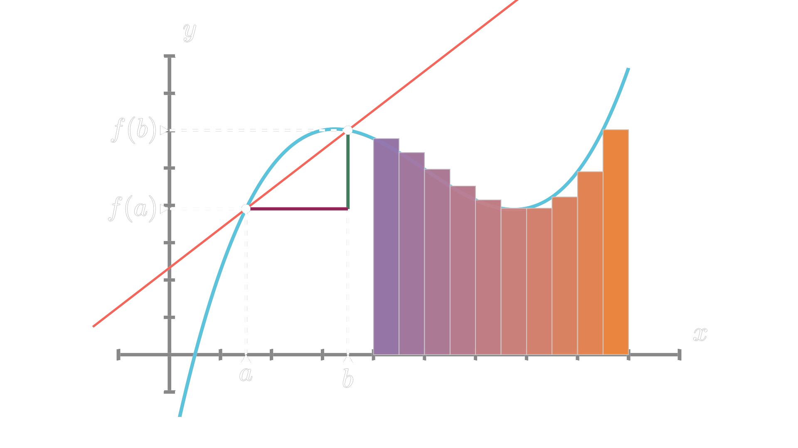

  

# ManimGL Interactive

一个 VS Code 扩展，为 [ManimGL](https://github.com/3b1b/manim) 提供实时预览和交互式开发体验。

## 前提条件

- **ManimGL 安装**：确保已安装 ManimGL 并可在终端中使用。
- **Python 环境**：扩展使用当前活动的 Python 环境。
- **自定义路径**：如果 manimgl 不在 PATH 中，可在设置中配置 `maningl.manimglPath`。

## 快速开始

1. 打开包含 Scene 类的 Python 文件
2. 点击 `construct` 方法上方的 **`▶ Run Scene`** 启动场景
3. 点击注释行上方的 **Checkpoint 按钮** 逐步执行动画

## 功能

### CodeLens 按钮

扩展会自动在代码中显示可交互的按钮：

| 按钮 | 说明 |
|------|------|
| `▶ Run Scene` | 运行场景（未启动时所有 checkpoint 位置都显示此按钮） |
| `🔒 CheckpointPaste` | 锁定状态，点击解锁 |
| `▶ CheckpointPaste` | 已解锁，点击执行 |
| `✅ CheckpointPaste` | 已执行，点击重新执行 |

### 选中执行

选中部分代码后点击任意 Checkpoint 按钮，会执行选中的内容而不影响 checkpoint 进度。

### 复制相机状态

获取当前 ManimGL 窗口的相机状态，复制为 `frame.reorient(...)` 代码。

## 快捷键

| 功能 | Windows/Linux | macOS |
|------|--------------|-------|
| 运行 Scene | `Ctrl+Shift+R` | `Cmd+Shift+R` |
| Checkpoint Paste | `Alt+Shift+C` | `Cmd+Shift+C` |
| Checkpoint Paste (录制) | `Ctrl+Shift+Alt+R` | `Cmd+Shift+Alt+R` |
| 复制相机状态 | `Ctrl+Alt+C` | `Cmd+Alt+C` |
| 退出 Scene | `Ctrl+Shift+Q` | `Cmd+Shift+Q` |

## 配置

| 设置 | 说明 | 默认值 |
|------|------|--------|
| `maningl.manimglPath` | ManimGL 可执行文件路径 | `""` (自动检测) |
| `maningl.pythonPath` | Python 模块搜索路径 (PYTHONPATH) | `""` |
| `maningl.terminalName` | 终端名称 | `"ManimGL Terminal"` |
| `maningl.autoSave` | 运行前自动保存 | `true` |
| `maningl.projectRoot` | ManimGL 项目根目录 | `""` |

## 致谢

灵感来自 [3Blue1Brown](https://github.com/3b1b) 的 Sublime Text 自定义命令插件。

## 许可证

MIT
